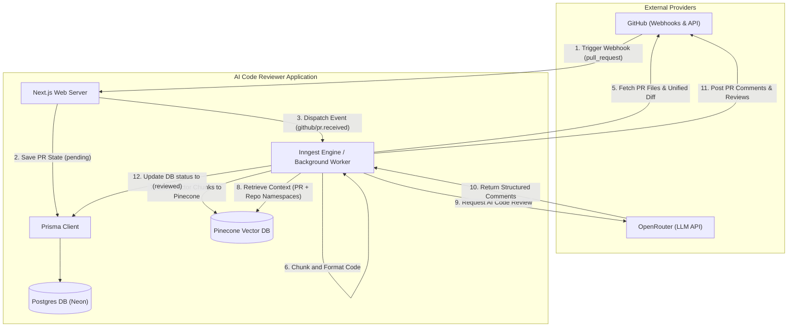

# AI Code Reviewer

An automated, context-aware code review system powered by **Next.js**, **Inngest**, **Prisma (PostgreSQL)**, **Pinecone (Vector DB)**, and LLMs via **OpenRouter**. It listens to GitHub Webhooks, indexes code changes, searches existing code repositories for context, and posts review comments back directly on GitHub Pull Requests.

---

## Overview

AI Code Reviewer automates the peer review process. Unlike basic static checkers or simple GPT prompts, this project leverages **Retrieval-Augmented Generation (RAG)** to provide deep codebase insights:

- **Repository Indexing**: Codebases are chunked, vectorized, and stored in Pinecone to establish global codebase knowledge.
- **Webhook Integration**: Real-time analysis starts immediately when a pull request is opened, updated, or reopened.
- **Namespaced Retrieval**: PR diffs are vectorized in isolated namespaces to allow the LLM to search for precise codebase matches before constructing reviews.
- **Auto-Commenting**: Structured feedback and suggestions are posted directly back to the pull request comments.

---

## High-Level Architecture (HLD)

The diagram below outlines the system design and integrations:



---

## Project Flow

### 1. Installation & Authentication

- The user logs in via **Better Auth** using their GitHub account.
- The user installs the **GitHub App** on the selected personal or organizational repositories.

### 2. Codebase Synchronization

- When a repository is synchronized, the app pulls the contents of the main branch via the GitHub API.
- The codebase is broken down into semantic code chunks, embedded into vectors, and stored in a repository-specific namespace inside **Pinecone**.

### 3. Webhook Delivery

- A developer creates, updates, or reopens a Pull Request on GitHub.
- GitHub fires a `pull_request` webhook event containing the installation ID, repository information, and PR details to the application's webhook API endpoint (`/api/github/webhooks`).

### 4. Database Persistence

- The app verifies the webhook signature and processes the payload in [webhook-handler.ts](file:///Users/vaibhav/Documents/Cohort-26/Projects/ai-code-reviewer/src/features/github/server/webhook-handler.ts).
- It registers the pull request status as `pending` inside PostgreSQL database via Prisma in [save-pull-request.ts](file:///Users/vaibhav/Documents/Cohort-26/Projects/ai-code-reviewer/src/features/reviews/server/save-pull-request.ts).

### 5. Inngest Event Orchestration

- The webhook handler dispatches a `github/pr.received` event to **Inngest**.
- Inngest starts the asynchronous background job [reviewPullRequest](file:///Users/vaibhav/Documents/Cohort-26/Projects/ai-code-reviewer/src/features/reviews/server/review-pr-function.ts#L14-L115).

### 6. RAG-Based Review Generation

- The job transitions the database record status to `processing`.
- It fetches the unified diff for all modified files in the pull request.
- The diff content is chunked and stored in a Pinecone namespace isolated for this specific pull request.
- Pinecone queries are performed across both the **PR-specific namespace** (to highlight immediate changes) and the **repository-wide namespace** (to retrieve surrounding codebase context).
- A prompt is compiled and sent to the LLM model via **OpenRouter** (e.g., `inclusionai/ling-3.0-flash:free`).

### 7. Feedback Dispatch

- The review suggestions are formatted and posted back to the GitHub PR comments section via the GitHub API.
- The pull request status in the database is set to `reviewed`, marking the completion of the job.

---

## Project Flow Diagram


## Project Setup Steps for a New Fork

Follow this step-by-step guide to set up a new fork of this codebase.

### Prerequisites

- Node.js (v20+ recommended) or [Bun](https://bun.sh/)
- A **PostgreSQL** Database (e.g., [Neon DB](https://neon.tech/))
- A **Pinecone** account (Vector DB)
- An **OpenRouter** account (for API access to LLMs)
- [ngrok](https://ngrok.com/) or another tunneling service for exposing local ports to the internet (necessary for GitHub webhooks)

---

### Step 1: Fork and Clone

1. Fork this repository on GitHub.
2. Clone your fork locally:
   ```bash
   git clone https://github.com/Vaibhav5122/AI-Code-Review.git
   cd ai-code-reviewer
   ```

### Step 2: Configure Environment Variables

1. Copy the example environment template:
   ```bash
   cp .env.example .env
   ```
2. Open `.env` and fill in the configuration options (refer to [`.env.example`](file:///Users/vaibhav/Documents/Cohort-26/Projects/ai-code-reviewer/.env.example) for placeholder descriptions).

---

### Step 3: Set Up a Database

1. Set up a PostgreSQL instance on Neon or another provider.
2. Put the connection string into the `DATABASE_URL` field inside your `.env` file.
3. Synchronize database schema and generate the Prisma Client:

   ```bash
   # Using Bun
   bunx prisma db push
   bunx prisma generate

   # Or using npm/npx
   npx prisma db push
   npx prisma generate
   ```

---

### Step 4: Configure GitHub OAuth App (Better Auth)

1. Go to your GitHub Developer Settings -> **OAuth Apps** -> **New OAuth App**.
2. Set the Homepage URL to `http://localhost:3000`.
3. Set the Authorization Callback URL to `http://localhost:3000/api/auth/callback/github` (adjust callback url accordingly if testing via a tunnel).
4. Save the generated `GITHUB_CLIENT_ID` and `GITHUB_CLIENT_SECRET` and paste them into your `.env`.
5. Run a command like `openssl rand -hex 32` to generate a random key and set it as `BETTER_AUTH_SECRET` in `.env`.

---

### Step 5: Configure the GitHub App

1. Go to GitHub Developer Settings -> **GitHub Apps** -> **New GitHub App**.
2. Set the webhook URL to your public tunnel (e.g., `https://your-subdomain.ngrok-free.dev/api/github/webhooks`).
3. Set a Webhook Secret and paste it into `GITHUB_WEBHOOK_SECRET` in `.env`.
4. Grant the following **Repository Permissions**:
   - **Checks**: Read & write
   - **Contents**: Read & write
   - **Metadata**: Read-only
   - **Pull requests**: Read & write
5. Subscribe to the following **Webhook Events**:
   - **Pull request** (opened, updated, closed, reopened, etc.)
6. Generate a **Private Key** under the app configuration, copy the generated `.pem` contents, format it on a single line (replacing newlines with `\n`), and paste it as `GITHUB_APP_PRIVATE_KEY` in `.env`.
7. Configure `GITHUB_APP_NAME` and `GITHUB_APP_ID` in `.env`.

---

### Step 6: Set Up Pinecone Index

1. Create an index in Pinecone with dimensions representing your embedding model (e.g., **1536** dimensions for standard embeddings).
2. Configure `PINECONE_INDEX` and `PINECONE_API_KEY` in `.env`.

---

### Step 7: Run the Application Locally

1. Start your local tunneling tool to expose port 3000 to GitHub webhooks:
   ```bash
   ngrok http 3000
   ```
   _Make sure to update `BETTER_AUTH_URL` and the GitHub App Webhook URL to match your ngrok domain._
2. Start the development server:
   ```bash
   bun run dev
   # or
   npm run dev
   ```
3. Start the Inngest local development server in a separate terminal:
   ```bash
   bunx inngest-cli@latest dev
   # or
   npx inngest-cli@latest dev
   ```
4. Access `http://localhost:3000` to register your user account, install the GitHub App onto your test repositories, and start reviewing!
